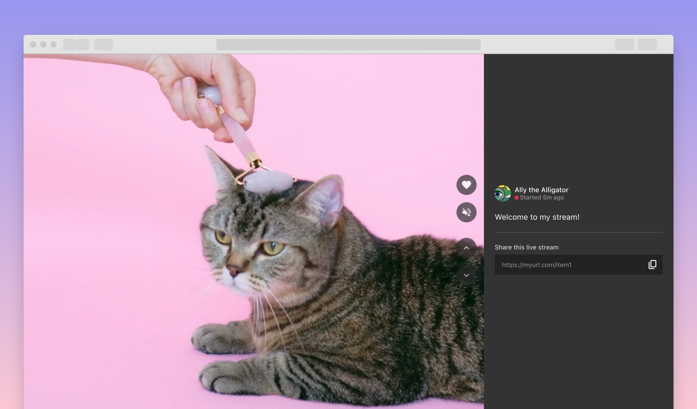

# Amazon IVS Feed Web Demo

A demo web application intended as an educational tool for demonstrating how to build a simple feed app, which loads and auto-plays an infinitely scrolling feed of Amazon IVS live streams.



**This project is intended for education purposes only and not for production usage.**

## Getting Started

In the project directory, run the following commands:

### `npm install`
Installs the dependencies of the project.

### `npm start`

Runs the app in the development mode. Open [http://localhost:3000](http://localhost:3000) to view it in your browser.

The page will automatically reload as you make edits. You will also see any lint errors in the console.


### Using your own Live streams

This demo loads streams and stream metadata from a local file (`public/feed.json`), which provides a json object containing an array of stream objects. Each stream object represents one video in the feed. To load your own IVS streams, you will need to modify `feedJSON` in the `App.jsx` file, to load your own json file, which should follow this structure:

```
{
  "streams": [
    {
      "id": <unique-stream-id>,
      "stream": {
        "channelArn": "<channel-ARN>",
        "health": "HEALTHY",
        "playbackUrl": "<channel-playback-url>.m3u8",
        "startTime": "<stream-start-time>",
        "state": "<live-status>",
        "viewerCount": <viewer-count>
      },
      "metadata": {
        "streamTitle": "<stream-title>",
        "userAvatar": "<streamer-avatar>",
        "userName": "<streamer-name>",
        "userColors": {
          "primary": "<streamer-color-1-hex>",
          "secondary": "<streamer-color-2-hex>"
        }
      }
    },
    {
      "id": 1,
      "stream": {
        ...
      },
      ...
    },
    ...
  ]
}
```


## About Amazon IVS
Amazon Interactive Video Service (Amazon IVS) is a managed live streaming solution that is quick and easy to set up, and ideal for creating interactive video experiences. [Learn more](https://aws.amazon.com/ivs/).

* [Amazon IVS docs](https://docs.aws.amazon.com/ivs/)
* [User Guide](https://docs.aws.amazon.com/ivs/latest/userguide/)
* [API Reference](https://docs.aws.amazon.com/ivs/latest/APIReference/)
* [Setting Up for Streaming with Amazon Interactive Video Service](https://aws.amazon.com/blogs/media/setting-up-for-streaming-with-amazon-ivs/)
* [Learn more about Amazon IVS on IVS.rocks](https://ivs.rocks/)
* [View more demos like this](https://ivs.rocks/examples)

## Security

See [CONTRIBUTING](CONTRIBUTING.md#security-issue-notifications) for more information.

## License

This library is licensed under the MIT-0 License. See the LICENSE file.
